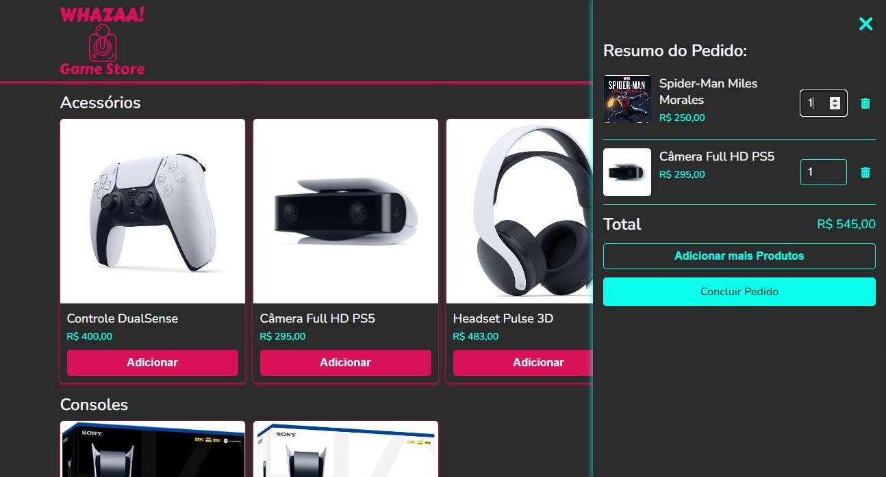
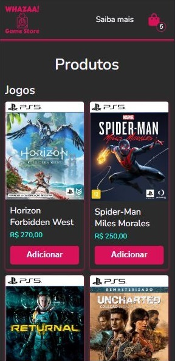
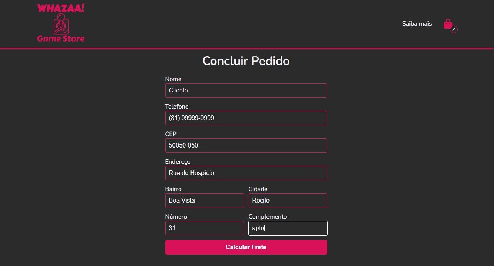

[![MIT License][license-shield]][license-url]
[![LinkedIn][linkedin-shield]][linkedin-url]

<!-- PROJECT LOGO -->
 

  
   

<h3 align="center">Whazaa! Game Store</h3>

  

    Loja online de videogames, consoles e acessórios 
     
     
    <a href="https://github.com/Brunnosama/whazaa-game-store"><strong>Explore a documentação »</strong></a>
     
     
    <a href="https://incredible-muffin-748c54.netlify.app">Veja a Demo</a>
    ·
    <a href="https://github.com/Brunnosama/whazaa-game-store/issues">Reporte um Bug</a>
  

<h4 align='center'>✔️ Projeto Concluído ✔️</h4>

  
   
  

<!-- TABLE OF CONTENTS -->

  
Sumário

  <ol>
    <li>
      <a href="#sobre-o-projeto">Sobre o Projeto</a>
      <ul>
        <li><a href="#construído-com">Construído com</a></li>
      </ul>
    </li>
    <li><a href="#licença">Licença</a></li>
    <li><a href="#contato">Contato</a></li>
  </ol>

<!-- ABOUT THE PROJECT -->
## Sobre o Projeto

Este projeto tem um objetivo educacional, como parte do curso Bootcamp em Desenvolvimento Front-end com React do <a href="https://curso.infnet.edu.br/bootcamp/desenvolvedor-front-end-react/">Instituto Infnet</a>. O projeto consiste numa loja de jogos, videogames e seus acessórios, com layout responsivo e que é capaz de catalogar os produtos selecionados, calcular o preço de custo e enviar uma solicitação de compra para o Whatsapp. A plataforma ainda conta com uma página de informações estilizada com Bootstrap, e permite trazer o endereço do cliente dinamicamente através do seu CEP.

### Construído com

* [Javascript](https://www.javascript.com/)
* [HTML](https://developer.mozilla.org/pt-BR/docs/Web/HTML)
* [CSS](https://www.w3schools.com/css/)
* [Bootstrap](https://getbootstrap.com)

<!-- LICENSE -->
## Licença

Este projeto esta sob a Licença do MIT. Veja `LICENSE.txt` para mais informações.

<!-- CONTACT -->
## Contato

Brunno Manoel Azevedo Pessôa - apbrunno@gmail.com

Link do Projeto: [https://github.com/Brunnosama/whazaa-game-store](https://github.com/Brunnosama/whazaa-game-store)

(<a href="#top">volte ao topo</a>)

<!-- MARKDOWN LINKS & IMAGES -->
<!-- https://www.markdownguide.org/basic-syntax/#reference-style-links -->
[contributors-shield]: https://img.shields.io/github/contributors/github_username/repo_name.svg?style=for-the-badge
[contributors-url]: https://github.com/github_username/repo_name/graphs/contributors
[forks-shield]: https://img.shields.io/github/forks/github_username/repo_name.svg?style=for-the-badge
[forks-url]: https://github.com/github_username/repo_name/network/members
[stars-shield]: https://img.shields.io/github/stars/github_username/repo_name.svg?style=for-the-badge
[stars-url]: https://github.com/github_username/repo_name/stargazers
[issues-shield]: https://img.shields.io/github/issues/othneildrew/Best-README-Template.svg?style=for-the-badge
[issues-url]: https://github.com/brunnosama/whazaa-game-store/issues
[license-shield]: https://img.shields.io/github/license/othneildrew/Best-README-Template.svg?style=for-the-badge
[license-url]: https://github.com/brunnosama/whazaa-game-store/blob/main/LICENSE
[linkedin-shield]: https://img.shields.io/badge/-LinkedIn-black.svg?style=for-the-badge&logo=linkedin&colorB=555
[linkedin-url]: https://www.linkedin.com/in/brunno-azevedo-pessoa/
[product-screenshot]: images/screenshot.png
